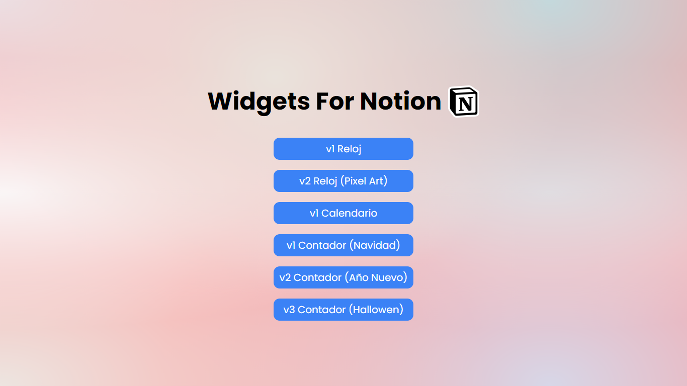

<h1 align="center">Widgets-for-Notion</h1>

Widgets para decorar tu espacio de trabajo en Notion.

Este repositorio contiene una colección de widgets creados con HTML y CSS, diseñados específicamente para integrarse en las páginas de Notion. Estos widgets, que incluyen relojes de diversos estilos, calendarios y contadores de fechas festivas, sirven como elementos decorativos que enriquecen visualmente y funcionalmente tus páginas de Notion. Cada widget está cuidadosamente elaborado para proporcionar una experiencia estética y práctica, facilitando la personalización y mejorando la utilidad de tu espacio de trabajo en Notion.

## Licence

<h3 align="center">MIT</h3>

---

  
  

